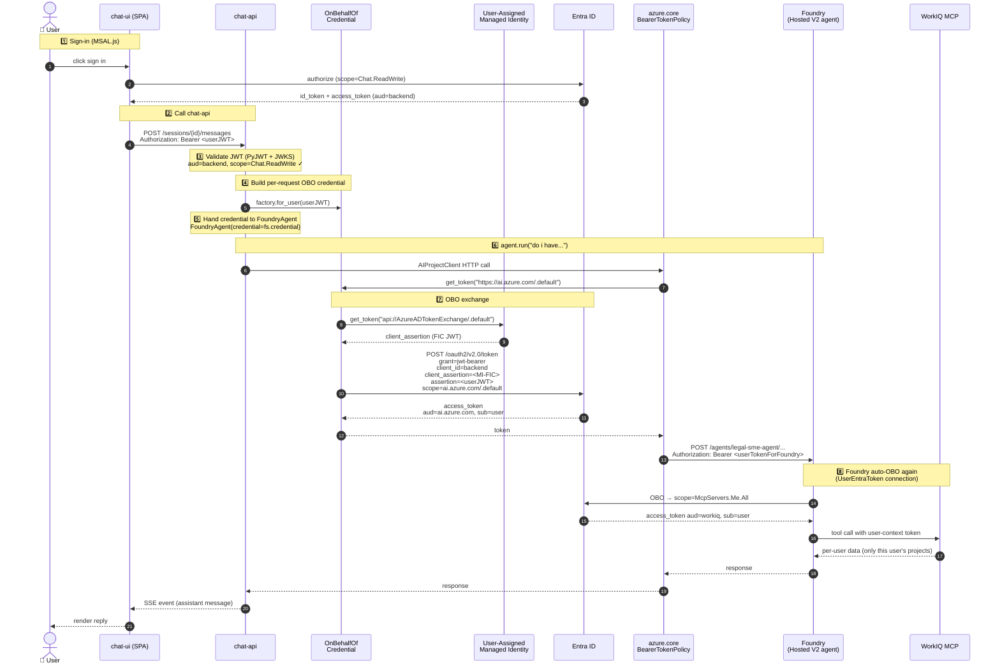

# multipersonworkflow

Multi-person, multi-agent workflow on Azure AI Foundry. Three registered
Foundry agents (submissions / tax / legal) hand off through a custom
group-chat orchestrator (`chat-api`), with a React SPA front-end
(`chat-ui`), Cosmos DB for project + assignment state, and three MCP
backends that expose workflow tools per role profile.

```
chat-ui (React/Vite SPA)
   │  Authorization: Bearer <user JWT for api://mpwflow-api/Chat.ReadWrite>
   ▼
chat-api (FastAPI, Python)
   │  validates JWT (PyJWT) → builds OnBehalfOfCredential per request
   │  via Federated Identity Credential (UAMI signs assertion → no secret)
   ▼
Azure AI Foundry  ← runs registered agents as the signed-in user
   ├─ submissions / tax / legal agents (FoundryAgent participants)
   ├─ workflow MCP (Cosmos-backed) — open today; per-role profile filter
   └─ WorkIQ MCP (Microsoft 365 User Profile) — ARA OBOs the user token
```

## Repo layout

| Path | What it is |
|---|---|
| `chat-api/` | Python/FastAPI orchestrator (custom group-chat router + handoff loop) |
| `chat-ui/` | React/Vite SPA, MSAL.js auth |
| `agents/{submissions,tax,legal}/` | Registered Foundry agent definitions + `create_agent.py` |
| `mcp-server/` | FastMCP server exposing workflow tools (3 deployed instances, one per profile) |
| `infra/` | Bicep templates + `main.parameters.json` |
| `scripts/` | One-shot setup scripts (Entra app regs + admin consent) |
| `PLAN.md` / `PLAN.html` | Living iteration plan |

## Reproducible deploy from zero

> Assumes you have an Azure subscription with quota in eastus2, an Azure
> AI Foundry project, and tenant-admin (or a friendly admin to run the
> consent script).

### 0. Tools

```pwsh
# Required CLIs (Windows)
winget install Microsoft.AzureCLI
winget install Microsoft.PowerShell      # PowerShell 7+
winget install Astral-sh.uv               # for chat-api / mcp-server Python deps
winget install OpenJS.NodeJS.LTS          # for chat-ui

az extension add --name containerapp --upgrade
```

### 1. Sign in

```pwsh
az login
az account set --subscription <subscription-id>
```

### 2. Provision base infra (Bicep)

This creates: Container Apps Environment, ACR, Cosmos, the chat-api UAMI,
and the three MCP backends. Foundry project + AOAI deployment are
expected to already exist.

```pwsh
cd infra
az group create -n rg-mpwflow-dev -l eastus2

# First pass — uses dummy chatApiImage/chatUiImage (placeholder bicep).
# Real images get pushed in step 5.
az deployment group create `
    -g rg-mpwflow-dev `
    -f main.bicep `
    -p main.parameters.json
```

After this, you'll have:
- Container App `ca-mpwflow-dev-chat-api` (placeholder image)
- Container App `ca-mpwflow-dev-chat-ui` (placeholder image)
- UAMI `id-mpwflow-dev-chat-api` (← needed for the FIC subject in step 3)
- 3× MCP Container Apps (one per agent profile)
- Cosmos DB account + container
- ACR `crmpwflowdev<suffix>`

### 3. Create the two Entra app registrations (ITERATION 5)

This is the auth foundation — done **once per environment**, not per
deploy.

```pwsh
cd ..
pwsh ./scripts/iter5-create-app-regs.ps1
```

What it creates (idempotent):
- `mpwflow-api` backend app reg — exposes `Chat.ReadWrite` scope
- `mpwflow-spa` SPA app reg — redirect URIs for chat-ui FQDN +
  `localhost:5173`
- API permissions on backend: `Microsoft Graph / User.Read`,
  `Azure AI / user_impersonation`, `WorkIQ / user_impersonation`
- Federated Identity Credential on backend with the chat-api UAMI's
  `principalId` as subject — enables **secretless OBO**
- Output JSON at `scripts/iter5-app-reg-output.json`

### 4. Admin: grant consent

A tenant admin runs:

```pwsh
pwsh ./scripts/iter5-grant-consent.ps1
```

This grants tenant-wide admin consent on all four delegated permissions
so signed-in users don't see consent prompts.

> **What admin consent actually does** — this is a common point of
> confusion. Admin consent **only pre-approves** every user in the
> tenant for the listed scopes; it does **not** allow the agents to
> act without a signed-in user. With or without it, the security model
> is identical:
>
> - Users still must sign in interactively to chat-ui
> - Their JWT is what the chat-api OBO swap exchanges for a Foundry
>   token issued **for that specific user**
> - Foundry ARA then OBOs again into WorkIQ as **that same user**
> - If the user is offline, no agent can call WorkIQ as them
> - Tokens expire (~1h) and require silent refresh through MSAL
>
> Skipping this step is fine — every new user just sees a one-time
> "this app wants permission to..." popup on their first sign-in. The
> only difference is UX.

### 5. Wire IDs into infra and chat-ui

Edit `infra/main.parameters.json` to add (values from
`scripts/iter5-app-reg-output.json`):

```json
{
  "entraTenantId":      { "value": "<tenantId>" },
  "entraBackendAppId":  { "value": "<backend.appId>" },
  "entraSpaAppId":      { "value": "<spa.appId>" }
}
```

Bicep wires these as env vars on chat-api (`ENTRA_TENANT_ID`,
`ENTRA_BACKEND_CLIENT_ID`) and as build args on chat-ui
(`VITE_TENANT_ID`, `VITE_SPA_CLIENT_ID`, `VITE_API_CLIENT_ID`).

### 6. Build + push images

```pwsh
$ACR = az acr list -g rg-mpwflow-dev --query "[0].name" -o tsv
az acr login -n $ACR

# chat-api
docker build -t "$ACR.azurecr.io/chat-api:0.5.0" ./chat-api
docker push   "$ACR.azurecr.io/chat-api:0.5.0"

# chat-ui (build args from step 5)
docker build -t "$ACR.azurecr.io/chat-ui:0.5.0" `
    --build-arg VITE_TENANT_ID=<tenantId> `
    --build-arg VITE_SPA_CLIENT_ID=<spa.appId> `
    --build-arg VITE_API_CLIENT_ID=<backend.appId> `
    ./chat-ui
docker push   "$ACR.azurecr.io/chat-ui:0.5.0"

# mcp-server (one image, three deployments — one per profile)
docker build -t "$ACR.azurecr.io/mcp-server:0.2.0" ./mcp-server
docker push   "$ACR.azurecr.io/mcp-server:0.2.0"
```

### 7. Re-deploy bicep with real image tags

```pwsh
cd infra
az deployment group create `
    -g rg-mpwflow-dev `
    -f main.bicep `
    -p main.parameters.json `
    -p chatApiImage="$ACR.azurecr.io/chat-api:0.5.0" `
    -p chatUiImage="$ACR.azurecr.io/chat-ui:0.5.0" `
    -p mcpImage="$ACR.azurecr.io/mcp-server:0.2.0"
```

### 8. Register the three Foundry agents

```pwsh
cd ../agents/submissions ; python create_agent.py
cd ../tax                ; python create_agent.py
cd ../legal              ; python create_agent.py
```

Each script is idempotent — re-runs publish a new version.

### 9. Smoke

```pwsh
# Open chat-ui in incognito
start "https://ca-mpwflow-dev-chat-ui.icyground-4e2c6fde.eastus2.azurecontainerapps.io"
```

Sign in with a tenant user. Send "Hi" — submissions agent should call
`GetMyDetails` (WorkIQ MCP) and greet you by name. Sign out, sign in
as a different user, repeat. The greeted name should change.

## Re-deploy of just chat-api or chat-ui

After the first full deploy, code-only iterations are:

```pwsh
# Bump version in chat-api/src/chat_api/__init__.py + pyproject.toml
docker build -t "$ACR.azurecr.io/chat-api:<new>" ./chat-api
docker push   "$ACR.azurecr.io/chat-api:<new>"
az containerapp update -g rg-mpwflow-dev -n ca-mpwflow-dev-chat-api `
    --image "$ACR.azurecr.io/chat-api:<new>" `
    --revision-suffix "v$(Get-Date -Format HHmmss)"
```

> The `--revision-suffix` is required: `az containerapp update` reuses
> the existing revision unless a suffix is supplied, which means a
> same-image redeploy won't restart the container. Use a fresh suffix
> when you need to refresh in-process caches like
> `get_resolved_version`.

## Iteration plan

See [`PLAN.md`](./PLAN.md) (or [`PLAN.html`](./PLAN.html) for a rendered
view). Iteration 5 is the current work — end-user identity passthrough
via MSAL → JWT → OBO+FIC.

## End-user identity passthrough (OBO + FIC)

When **System Administrator** asks "do I have any open projects?", the
WorkIQ MCP server must see a token *for that user* — not the chat-api's
service identity. Otherwise everyone would see everyone's projects.

### Token flow



### Scopes used at each hop

| Hop | Scope | Asked by | Audience of returned token |
|-----|-------|----------|----------------------------|
| 1. Browser → backend | `api://<backend-app-id>/Chat.ReadWrite` `openid` `profile` `offline_access` | chat-ui (MSAL.js) | backend app reg |
| 2. MI → Entra (assertion) | `api://AzureADTokenExchange/.default` | `OnBehalfOfCredential.client_assertion_func` | special audience used only as a FIC `client_assertion` |
| 3. backend → Foundry (OBO) | `https://ai.azure.com/.default` | `AIProjectClient` via `BearerTokenPolicy` | `https://ai.azure.com` (Foundry data plane) |
| 4. Foundry → WorkIQ (auto-OBO) | `api://<workiq-app-id>/McpServers.Me.All` | Foundry runtime (`UserEntraToken` connection) | WorkIQ MCP app reg |

The `.default` suffix means *"give me every scope that has been
admin-consented for this resource"* (vs. naming individual scopes).
Required for client_credentials, OBO, and managed-identity flows.

### Where each scope is set

- **Hop 1** — `chat-ui/src/auth.ts` `loginRequest.scopes`. The backend
  app reg exposes `Chat.ReadWrite` as a delegated scope.
- **Hop 2** — `chat-api/src/chat_api/foundry_credential.py` — the
  assertion func calls
  `ManagedIdentityCredential().get_token("api://AzureADTokenExchange/.default")`.
  The federated credential on the backend app reg must trust this UAMI's
  `principalId` (NOT its clientId).
- **Hop 3** — **NOT in our code.** Hard-coded inside `azure-ai-projects`
  (`AIProjectClient._config.credential_scopes`). The OBO exchange asks
  Entra for this scope; the backend app reg must have admin-consented
  API permission to *Azure AI Services / user_impersonation* (or
  equivalent) — that's why the user only sees the consent prompt once.
- **Hop 4** — Configured per-tool in the **Foundry agent definition**
  (auth type = `UserEntraToken`, scope = `McpServers.Me.All`). Foundry
  stores the scope and runs the second OBO automatically when invoking
  the MCP connection.

### Why a Federated Identity Credential (FIC) instead of a client secret?

chat-api has no client secret. It proves it's the backend app reg by
minting a FIC assertion: it asks its UAMI for a token with audience
`api://AzureADTokenExchange`, then hands that token to Entra as the
`client_assertion` in the OBO call. The backend app reg has a federated
credential pointing at the UAMI's `principalId` — Entra trusts the
assertion because it's signed by a UAMI that was pre-approved.

Net result: *no service principal can spoof a user, no user token leaves
the trust boundary unencrypted, and there is no client secret to rotate
or leak.*

### Key code references

| What | File / line |
|------|-------------|
| MSAL config | `chat-ui/src/auth.ts` |
| JWT validation | `chat-api/src/chat_api/token_validator.py` |
| Caller extraction | `chat-api/src/chat_api/auth.py` |
| OBO credential factory | `chat-api/src/chat_api/foundry_credential.py` |
| Per-request OBO build | `chat-api/src/chat_api/routes/sessions.py` (`_build_user_credential`) |
| Hand-off to FoundryAgent | `chat-api/src/chat_api/af_orchestrator.py:210` (`credential=fs.credential`) |
| App reg + FIC setup | `scripts/iter5-create-app-regs.ps1`, `scripts/iter5-grant-consent.ps1` |

