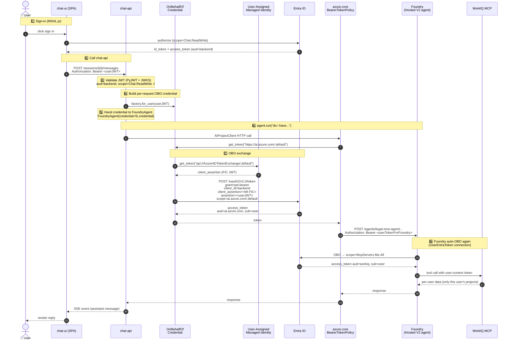

# multipersonworkflow

Multi-person, multi-agent workflow on Azure AI Foundry. Three registered
Foundry agents (submissions / tax / legal) hand off through a custom
group-chat orchestrator (`chat-api`), with a React SPA front-end
(`chat-ui`), Cosmos DB for project + assignment state, and three MCP
backends that expose workflow tools per role profile.

```
chat-ui (React/Vite SPA)
   │  Authorization: Bearer <user JWT for api://mpwflow-api/Chat.ReadWrite>
   ▼
chat-api (FastAPI, Python)
   │  validates JWT (PyJWT) → builds OnBehalfOfCredential per request
   │  via Federated Identity Credential (UAMI signs assertion → no secret)
   ▼
Azure AI Foundry  ← runs registered agents as the signed-in user
   ├─ submissions / tax / legal agents (FoundryAgent participants)
   ├─ workflow MCP (Cosmos-backed) — open today; per-role profile filter
   └─ WorkIQ MCP (Microsoft 365 User Profile) — ARA OBOs the user token
```

## Repo layout

| Path | What it is |
|---|---|
| `chat-api/` | Python/FastAPI orchestrator (custom group-chat router + handoff loop) |
| `chat-ui/` | React/Vite SPA, MSAL.js auth |
| `agents/{submissions,tax,legal}/` | Registered Foundry agent definitions + `create_agent.py` |
| `mcp-server/` | FastMCP server exposing workflow tools (3 deployed instances, one per profile) |
| `infra/` | Bicep templates + `main.bicepparam` (azd-driven) |
| `azure.yaml` | azd top-level service + hook configuration |
| `scripts/admin/` | One-time admin scripts (Entra app regs, tenant consent, Cosmos seed) |
| `scripts/pre-deploy/` | azd `predeploy` hook — writes `chat-ui/.env.production` so Vite inlines real MSAL IDs at build |
| `scripts/post-provision/` | azd `postprovision` hook — registers Foundry agents |
| `scripts/post-deploy/` | azd `postdeploy` hook — fans the MCP image out to tax + legal apps |
| `.env.sample` | Copy → `.env`, fill in, then `azd up` |
| `PLAN.md` / `PLAN.html` | Living iteration plan |

## Deploy from zero (`azd up`)

Five steps. Steps 1 and 4 are admin-only; steps 2-3-5 are developer flow.

### 0. Tools

```pwsh
winget install Microsoft.AzureCLI
winget install Microsoft.Azd                  # Azure Developer CLI
winget install Microsoft.PowerShell           # PowerShell 7+
winget install Astral-sh.uv                   # for local Python work
winget install OpenJS.NodeJS.LTS              # for local chat-ui work

az login
azd auth login
```

### 1. Admin: prerequisites in the Foundry portal (manual, one-time)

`azd up` does **not** provision Foundry — the WorkIQ catalog MCP
connections are M365 portal actions that can't be automated.

In the target Microsoft 365 tenant:

1. Create / pick an **Azure AI Foundry** project.
2. Deploy a chat model (e.g. `gpt-4o-mini`) and note the deployment name.
3. Add two WorkIQ catalog MCP connections (*Project → Connections →
   + New connection → Microsoft Agent 365*):
   - **`WorkIQUser`** → `https://agent365.svc.cloud.microsoft/agents/servers/mcp_MeServer`
   - **`WorkIQMail`** → `https://agent365.svc.cloud.microsoft/agents/servers/mcp_MailTools`

   The names **must** match exactly — `agents/{tax,legal}/create_agent.py`
   look them up by name.

### 2. Admin: create the two Entra app registrations (first pass)

```pwsh
pwsh ./scripts/admin/setup-entra.ps1
```

Outputs `tenantId`, `<prefix>-api appId`, `<prefix>-spa appId` (prefix
defaults to `AZURE_BASE_NAME` from `.env`). Paste them into `.env` (next
step). See [`scripts/admin/README.md`](./scripts/admin/README.md) for
what it creates.

> **Why it tells you to "re-run after `azd up`"** — the script wires up
> a [Federated Identity Credential](https://learn.microsoft.com/entra/workload-id/workload-identity-federation)
> on the backend app reg that points at the chat-api UAMI's
> `principalId`. That UAMI doesn't exist until `azd up` provisions it
> in step 4 below — so the first pass *creates the app regs only*, and
> a second pass (step 5) *adds the FIC + prod redirect URIs*. The
> script is idempotent — both runs only add what's missing.

### 3. Developer: configure `.env` and run `azd up`

```pwsh
cp .env.sample .env
# Fill in:
#   AZURE_SUBSCRIPTION_ID
#   FOUNDRY_PROJECT_ENDPOINT
#   FOUNDRY_MODEL_DEPLOYMENT_NAME
#   ENTRA_TENANT_ID, ENTRA_BACKEND_APP_ID, ENTRA_SPA_APP_ID  (from step 2)

azd env new mpwflow-dev          # one-time per environment
Get-Content .env | ForEach-Object {
    if ($_ -match '^\s*([A-Z0-9_]+)=(.*)$') { azd env set $matches[1] $matches[2] }
}

azd up
```

`azd up` will:
1. Provision Bicep (`infra/main.bicep` via `infra/main.bicepparam`):
   Cosmos + 3 containers, ACR, Container Apps env, Log Analytics +
   App Insights, the chat-api UAMI (with FIC seat reserved on the
   backend app reg), and 5 Container Apps (chat-api, chat-ui, 3× MCP).
2. Build + push the chat-api / chat-ui / mcp-server images to ACR
   via `az acr build` (no local Docker needed). The **predeploy** hook
   (`scripts/pre-deploy/write_chat_ui_env.ps1`) runs first and writes
   `chat-ui/.env.production` from the azd env's `ENTRA_*` values so
   Vite inlines the real MSAL `tenantId` / `clientId` into the JS bundle
   at build time (otherwise sign-in fails with `AADSTS900144`).
3. Run the **postprovision** hook
   (`scripts/post-provision/register_agents.ps1`) which registers /
   updates the 3 Foundry PromptAgents (submissions, tax, legal) using
   the MCP FQDNs that azd just created.
4. Run the **postdeploy** hook
   (`scripts/post-deploy/fanout_mcp_image.ps1`) which copies the freshly
   built mcp-server image from the submissions container app onto the
   tax + legal container apps (single image, three apps, different
   `AGENT_PROFILE` env var per app).

### 4. Admin: finalise auth (FIC + redirect URIs + consent)

After `azd up` finishes, the chat-api UAMI exists. Re-run the Entra
script — this time it adds the federated credential binding the
backend app reg to that UAMI, plus the production redirect URI on the
SPA. Then a tenant admin grants consent:

```pwsh
$values = azd env get-values --output json | ConvertFrom-Json
pwsh ./scripts/admin/setup-entra.ps1 `
    -UamiPrincipalId $values.chatApiUamiPrincipalId `
    -ChatUiFqdn      $values.chatUiAppFqdn
# (-Prefix + -EnvSuffix auto-load from .env)

pwsh ./scripts/admin/grant-consent.ps1
```

### 5. Admin: seed Cosmos routing queues + grant data-plane RBAC

The `routing` container needs at least a `tax` and `legal` document
(round-robin queues of SME user emails) before the orchestrator can
assign work. Edit `scripts/admin/seed_routing.py` to use real users in
your tenant, then run it. You also need Cosmos data-plane RBAC on your
own user (Bicep only grants it to the chat-api UAMI, not to admins).

```pwsh
$values = azd env get-values --output json | ConvertFrom-Json
$me = az ad signed-in-user show --query id -o tsv

# One-time: grant yourself "Cosmos DB Built-in Data Contributor"
az cosmosdb sql role assignment create `
  --account-name $values.cosmosAccountName `
  -g $values.AZURE_RESOURCE_GROUP `
  --scope "/" `
  --principal-id $me `
  --role-definition-id "00000000-0000-0000-0000-000000000002"

# Seed routing/tax + routing/legal docs
python ./scripts/admin/seed_routing.py
```

### 6. Smoke

```pwsh
$values = azd env get-values --output json | ConvertFrom-Json
Start-Process "https://$($values.chatUiAppFqdn)"
```

Sign in with a tenant user. Send "Hi" — the submissions agent should
greet you by name (via WorkIQ `GetMyDetails`). Tax / legal questions
are routed to the matching SME agent and answered as you (OBO).

## Re-deploy a single service

```pwsh
azd deploy chat-api      # or chat-ui, or mcp-server
```

`azd deploy` rebuilds + pushes a new image and updates the matching
Container App. To re-run a hook only, run the script directly:

```pwsh
pwsh ./scripts/pre-deploy/write_chat_ui_env.ps1     # refresh chat-ui MSAL config
pwsh ./scripts/post-provision/register_agents.ps1   # re-register Foundry agents
pwsh ./scripts/post-deploy/fanout_mcp_image.ps1     # re-fan-out mcp image
```

> **Note for `azd deploy chat-ui`:** when targeting a single service,
> some azd versions skip the global `predeploy` hook. Run
> `pwsh ./scripts/pre-deploy/write_chat_ui_env.ps1` first if MSAL IDs
> have changed (or just use `azd up` / `azd deploy`, which always fires
> the hook). The script writes `chat-ui/.env.production` (git-ignored).

## Tear down

```pwsh
azd down --purge --force
```

Note: this only removes resources `azd up` created. It does **not**
delete the Foundry project, WorkIQ connections, or Entra app regs —
those are admin-managed prerequisites.

## Iteration plan

See [`PLAN.md`](./PLAN.md) (or [`PLAN.html`](./PLAN.html) for a rendered
view). Iteration 8 is the current work — collapsing deploy to a single
`azd up` driven by `.env`.

## End-user identity passthrough (OBO + FIC)

When **System Administrator** asks "do I have any open projects?", the
WorkIQ MCP server must see a token *for that user* — not the chat-api's
service identity. Otherwise everyone would see everyone's projects.

### Token flow



### Scopes used at each hop

| Hop | Scope | Asked by | Audience of returned token |
|-----|-------|----------|----------------------------|
| 1. Browser → backend | `api://<backend-app-id>/Chat.ReadWrite` `openid` `profile` `offline_access` | chat-ui (MSAL.js) | backend app reg |
| 2. MI → Entra (assertion) | `api://AzureADTokenExchange/.default` | `OnBehalfOfCredential.client_assertion_func` | special audience used only as a FIC `client_assertion` |
| 3. backend → Foundry (OBO) | `https://ai.azure.com/.default` | `AIProjectClient` via `BearerTokenPolicy` | `https://ai.azure.com` (Foundry data plane) |
| 4. Foundry → WorkIQ (auto-OBO) | `api://<workiq-app-id>/McpServers.Me.All` | Foundry runtime (`UserEntraToken` connection) | WorkIQ MCP app reg |

The `.default` suffix means *"give me every scope that has been
admin-consented for this resource"* (vs. naming individual scopes).
Required for client_credentials, OBO, and managed-identity flows.

### Where each scope is set

- **Hop 1** — `chat-ui/src/auth.ts` `loginRequest.scopes`. The backend
  app reg exposes `Chat.ReadWrite` as a delegated scope.
- **Hop 2** — `chat-api/src/chat_api/foundry_credential.py` — the
  assertion func calls
  `ManagedIdentityCredential().get_token("api://AzureADTokenExchange/.default")`.
  The federated credential on the backend app reg must trust this UAMI's
  `principalId` (NOT its clientId).
- **Hop 3** — **NOT in our code.** Hard-coded inside `azure-ai-projects`
  (`AIProjectClient._config.credential_scopes`). The OBO exchange asks
  Entra for this scope; the backend app reg must have admin-consented
  API permission to *Azure AI Services / user_impersonation* (or
  equivalent) — that's why the user only sees the consent prompt once.
- **Hop 4** — Configured per-tool in the **Foundry agent definition**
  (auth type = `UserEntraToken`, scope = `McpServers.Me.All`). Foundry
  stores the scope and runs the second OBO automatically when invoking
  the MCP connection.

### Why a Federated Identity Credential (FIC) instead of a client secret?

chat-api has no client secret. It proves it's the backend app reg by
minting a FIC assertion: it asks its UAMI for a token with audience
`api://AzureADTokenExchange`, then hands that token to Entra as the
`client_assertion` in the OBO call. The backend app reg has a federated
credential pointing at the UAMI's `principalId` — Entra trusts the
assertion because it's signed by a UAMI that was pre-approved.

Net result: *no service principal can spoof a user, no user token leaves
the trust boundary unencrypted, and there is no client secret to rotate
or leak.*

### Key code references

| What | File / line |
|------|-------------|
| MSAL config | `chat-ui/src/auth.ts` |
| JWT validation | `chat-api/src/chat_api/token_validator.py` |
| Caller extraction | `chat-api/src/chat_api/auth.py` |
| OBO credential factory | `chat-api/src/chat_api/foundry_credential.py` |
| Per-request OBO build | `chat-api/src/chat_api/routes/sessions.py` (`_build_user_credential`) |
| Hand-off to FoundryAgent | `chat-api/src/chat_api/af_orchestrator.py:210` (`credential=fs.credential`) |
| App reg + FIC setup | `scripts/admin/setup-entra.ps1`, `scripts/admin/grant-consent.ps1` |

